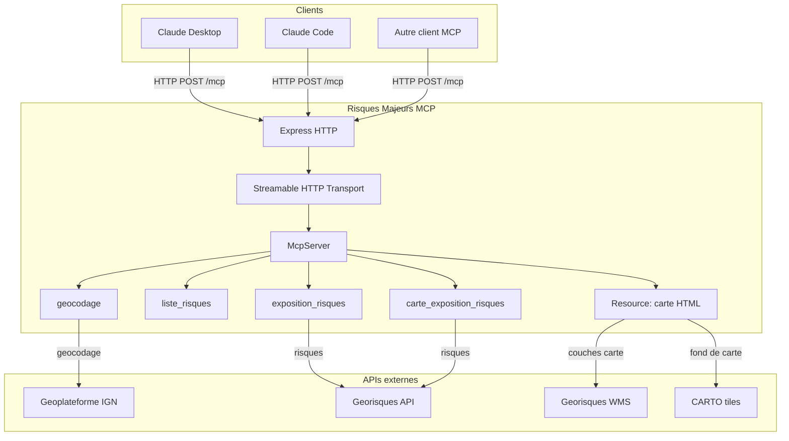
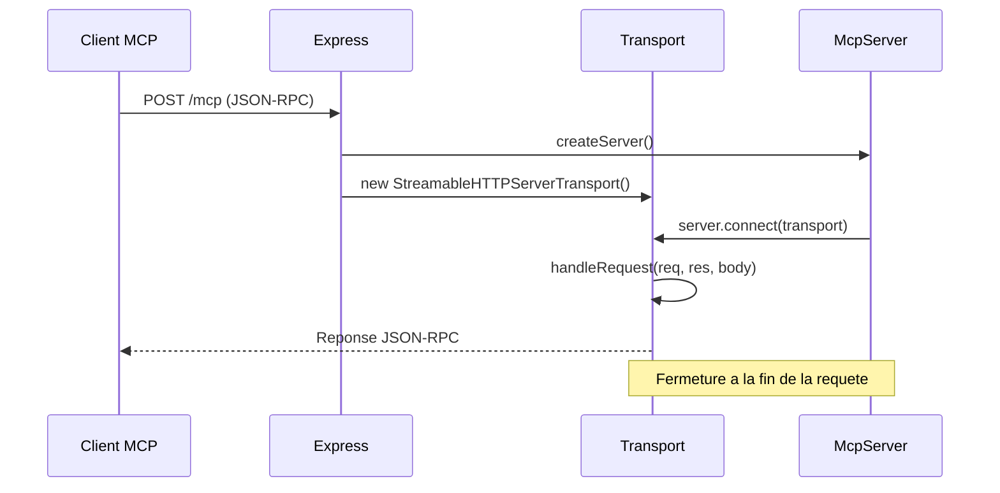

# Architecture

## Vue d'ensemble



## Structure du projet

```
risques-majeurs-mcp/
├── server/                 # Code serveur (TypeScript, compile par tsc)
│   ├── index.ts            # Point d'entree Express + transport MCP
│   ├── server.ts           # Definition du serveur MCP et des outils
│   ├── risques.ts          # Definition des 7 risques (fetch, schema, texte, couches)
│   └── utils.ts            # Helpers (appels API, sources WMS, icones SVG)
├── client/                 # Application carte (TypeScript, bundle par Vite)
│   ├── mcp-app.html        # Page HTML
│   ├── mcp-app.ts          # App MCP (MapLibre GL)
│   ├── mcp-app.css         # Styles
│   └── controls.ts         # Controles MapLibre (couches, legendes, plein ecran)
├── dist/                   # Build de production (genere)
├── documentation/          # Documentation Docusaurus
├── package.json
├── tsconfig.json           # Config TypeScript client
├── tsconfig.server.json    # Config TypeScript serveur
├── vitest.config.ts        # Config des tests
└── mise.toml               # Taches mise
```

## Transport MCP

Le serveur utilise le transport **Streamable HTTP** du SDK MCP. Chaque requete HTTP cree une nouvelle instance du serveur MCP et du transport, sans gestion de sessions. C'est un choix delibere : tous les outils exposes sont en lecture seule et idempotents, il n'y a donc pas besoin de maintenir un etat entre les requetes.



## Build

Le build se fait en deux etapes :

1. **Serveur** : `tsc` compile les fichiers TypeScript de `server/` vers `dist/` (target ES2024, modules Node16)
2. **Client** : Vite bundle `client/mcp-app.html` en un **fichier HTML unique** (via `vite-plugin-singlefile`) dans `dist/client/`

Le fichier HTML unique est ensuite servi comme ressource MCP par le serveur, ce qui permet au client MCP d'afficher la carte directement.

## Definition d'un risque

Chaque risque dans `server/risques.ts` est un objet avec la structure suivante :

```typescript
{
  code: string;            // Identifiant unique
  libelle: string;         // Nom affiche
  fetch(lon, lat);         // Appel API Georisques (aiguillage vers l'endpoint v1 ou v2 selon la configuration du jeton d'authentification)
  outputSchema: ZodSchema; // Schema de sortie (Zod)
  text(exposition);        // Rendu texte
  layers: [{               // Couches carte (peut etre vide)
    id: string;
    nom: string;
    source(exposition);    // Source MapLibre (raster WMS ou GeoJSON)
    layer: object | object[];   // Config de la couche MapLibre (tableau accepte pour appliquer differents styles)
    legend(exposition);    // Element DOM de legende
  }]
}
```

Cette structure modulaire facilite l'ajout de nouveaux risques : il suffit d'ajouter un nouvel objet au tableau `RISQUES`.
