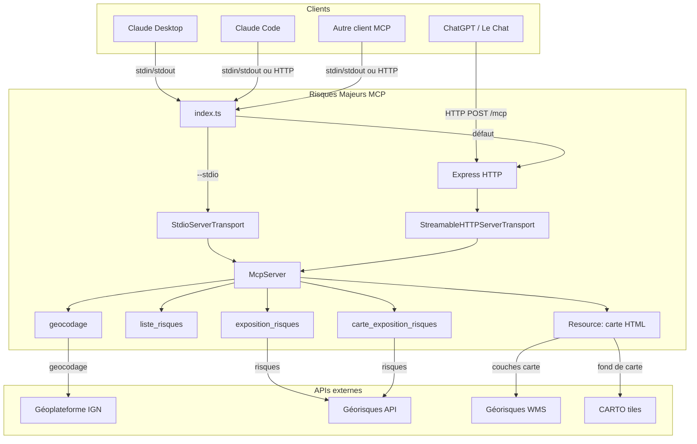
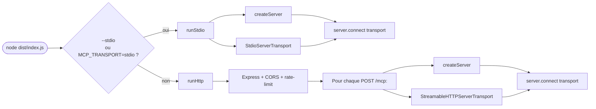
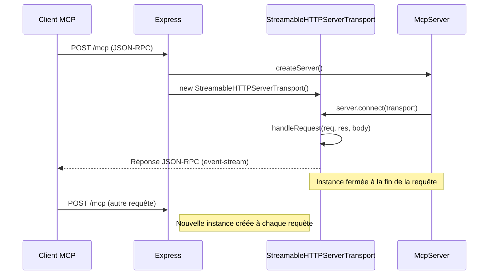
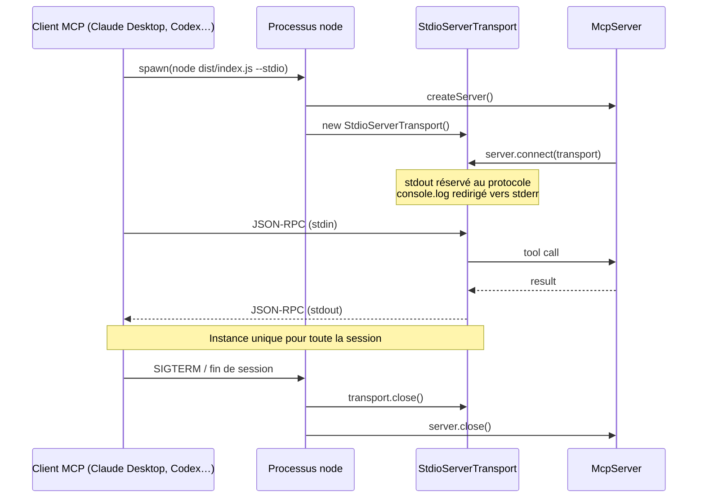

# Architecture

## Vue d'ensemble

Le serveur supporte **deux transports MCP** au choix : **stdio** (le client lance le serveur comme sous-processus) et **Streamable HTTP** (le serveur écoute sur un port). Les deux modes partagent exactement le même `McpServer` et les mêmes outils — seule la couche transport change.



## Structure du projet

```
risques-majeurs-mcp/
├── server/                 # Code serveur (TypeScript, compile par tsc)
│   ├── index.ts            # Point d'entrée Express + transport MCP
│   ├── server.ts           # Définition du serveur MCP et des outils
│   ├── risques.ts          # Définition des 7 risques (fetch, schéma, texte, couches)
│   └── utils.ts            # Helpers (appels API, sources WMS, icones SVG)
├── client/                 # Application carte (TypeScript, bundle par Vite)
│   ├── mcp-app.html        # Page HTML
│   ├── mcp-app.ts          # App MCP (MapLibre GL)
│   ├── mcp-app.css         # Styles
│   └── controls.ts         # Controles MapLibre (couches, légendes, plein ecran)
├── dist/                   # Build de production (génère)
├── documentation/          # Documentation Docusaurus
├── package.json
├── tsconfig.json           # Config TypeScript client
├── tsconfig.server.json    # Config TypeScript serveur
├── vitest.config.ts        # Config des tests
└── mise.toml               # Taches mise
```

## Transports MCP

`server/index.ts` détecte le flag CLI `--stdio` (ou la variable `MCP_TRANSPORT=stdio`) au démarrage et choisit le transport en conséquence. Les deux modes partagent le même `McpServer`, créé par `createServer()` dans `server/server.ts`.



### Mode Streamable HTTP (par défaut)

Le serveur écoute sur `http://localhost:3000/mcp`. Chaque requête HTTP crée une nouvelle instance du `McpServer` et du transport, sans gestion de sessions. C'est un choix délibéré : tous les outils exposés sont en lecture seule et idempotents, il n'y a donc pas besoin de maintenir un état entre les requêtes.



Avantages : multi-clients, hot-reload en dev, exposition possible via tunnel HTTPS (ngrok, cloudflared) pour ChatGPT / Le Chat.

### Mode stdio

Le client MCP lance le serveur comme sous-processus et communique via stdin (requêtes) / stdout (réponses). Une seule instance du `McpServer` vit pour toute la durée du processus.



Avantages : pas de port à ouvrir, démarrage simple via `npx github:MAIF/risques-majeurs-mcp --stdio`, isolation par client.

### Comparatif

| Aspect | Streamable HTTP | stdio |
|---|---|---|
| Lancement | `npm start` (ou équivalent) | Le client lance le processus |
| Communication | HTTP POST sur `/mcp` | stdin / stdout |
| Cycle de vie | Nouvelle instance par requête | Instance unique par processus |
| Multi-clients | Oui (un seul serveur partagé) | Non (un processus par client) |
| Logs | `console.log` → stdout | Redirigé vers stderr (stdout = protocole) |
| Cas d'usage | Dev (hot-reload), tunnel public, multi-utilisateurs | Claude Desktop, Codex CLI, install via `npx` |

## Build

Le build se fait en deux etapes :

1. **Serveur** : `tsc` compile les fichiers TypeScript de `server/` vers `dist/` (target ES2024, modules Node16)
2. **Client** : Vite bundle `client/mcp-app.html` en un **fichier HTML unique** (via `vite-plugin-singlefile`) dans `dist/client/`

Le fichier HTML unique est ensuite servi comme ressource MCP par le serveur, ce qui permet au client MCP d'afficher la carte directement.

## Définition d'un risque

Chaque risque dans `server/risques.ts` est un objet avec la structure suivante :

```typescript
{
  code: string;            // Identifiant unique
  libelle: string;         // Nom affiche
  fetch(lon, lat);         // Appel API Georisques (aiguillage vers l'endpoint v1 ou v2 selon la configuration du jeton d'authentification)
  outputSchema: ZodSchema; // Schéma de sortie (Zod)
  text(exposition);        // Rendu texte
  layers: [{               // Couches carte (peut être vide)
    id: string;
    nom: string;
    source(exposition);    // Source MapLibre (raster WMS ou GeoJSON)
    layer: object | object[];   // Config de la couche MapLibre (tableau accepte pour appliquer différents styles)
    legend(exposition);    // Element DOM de légende
  }]
}
```

Cette structure modulaire facilite l'ajout de nouveaux risques : il suffit d'ajouter un nouvel objet au tableau `RISQUES`.
