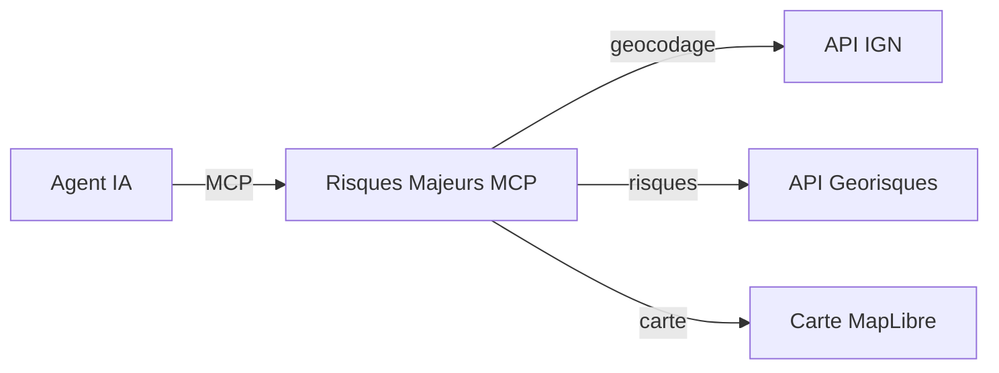

# Les outils MCP

Le serveur Risques Majeurs MCP expose **4 outils** que les agents IA peuvent appeler pour interroger les risques majeurs en France.

## Vue d'ensemble



| Outil | Description | Entrée | Sortie |
|---|---|---|---|
| [**geocodage**](./geocodage) | Géocoder une adresse | Adresse textuelle | Coordonnees GPS, code INSEE |
| **liste_risques** | Lister les risques disponibles | — | Liste des risques avec disponibilite |
| [**exposition_risques**](./exposition-risques) | Évaluer l'exposition aux risques | Longitude, latitude | Texte descriptif par risque |
| [**carte_exposition_risques**](./carte-exposition-risques) | Carte interactive des risques | Longitude, latitude | Données structurées + carte |

## Chaine d'appels typique

En general, un agent IA enchaîne les appels dans cet ordre :

1. **`geocodage`** — L'utilisateur fournit une adresse, l'agent la géocode pour obtenir les coordonnées
2. **`exposition_risques`** ou **`carte_exposition_risques`** — L'agent évalué les risques aux coordonnées obtenues

L'outil `liste_risques` permet à l'agent de savoir quels risques sont disponibles avant d'appeler les outils d'exposition.

## Filtrage des risques

Les outils `exposition_risques` et `carte_exposition_risques` acceptent un parametre optionnel `risques` qui permet de filtrer les risques a évaluer. Par défaut, tous les risques disponibles sont évalués.

```json
{
  "longitude": 2.3522,
  "latitude": 48.8566,
  "risques": ["argiles", "inondations"]
}
```
