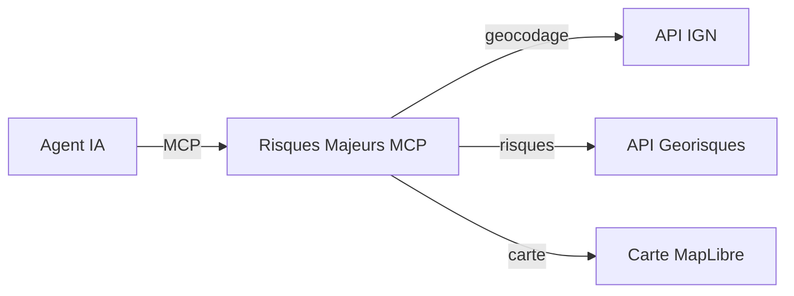

# Les outils MCP

Le serveur Risques Majeurs MCP expose **4 outils** que les agents IA peuvent appeler pour interroger les risques majeurs en France.

## Vue d'ensemble



| Outil | Description | Entree | Sortie |
|---|---|---|---|
| [**geocodage**](./geocodage) | Geocoder une adresse | Adresse textuelle | Coordonnees GPS, code INSEE |
| **liste_risques** | Lister les risques disponibles | — | Liste des risques avec disponibilite |
| [**exposition_risques**](./exposition-risques) | Evaluer l'exposition aux risques | Longitude, latitude | Texte descriptif par risque |
| [**carte_exposition_risques**](./carte-exposition-risques) | Carte interactive des risques | Longitude, latitude | Donnees structurees + carte |

## Chaine d'appels typique

En general, un agent IA enchaine les appels dans cet ordre :

1. **`geocodage`** — L'utilisateur fournit une adresse, l'agent la geocode pour obtenir les coordonnees
2. **`exposition_risques`** ou **`carte_exposition_risques`** — L'agent evalue les risques aux coordonnees obtenues

L'outil `liste_risques` permet a l'agent de savoir quels risques sont disponibles avant d'appeler les outils d'exposition.

## Filtrage des risques

Les outils `exposition_risques` et `carte_exposition_risques` acceptent un parametre optionnel `risques` qui permet de filtrer les risques a evaluer. Par defaut, tous les risques disponibles sont evalues.

```json
{
  "longitude": 2.3522,
  "latitude": 48.8566,
  "risques": ["argiles", "inondations"]
}
```
