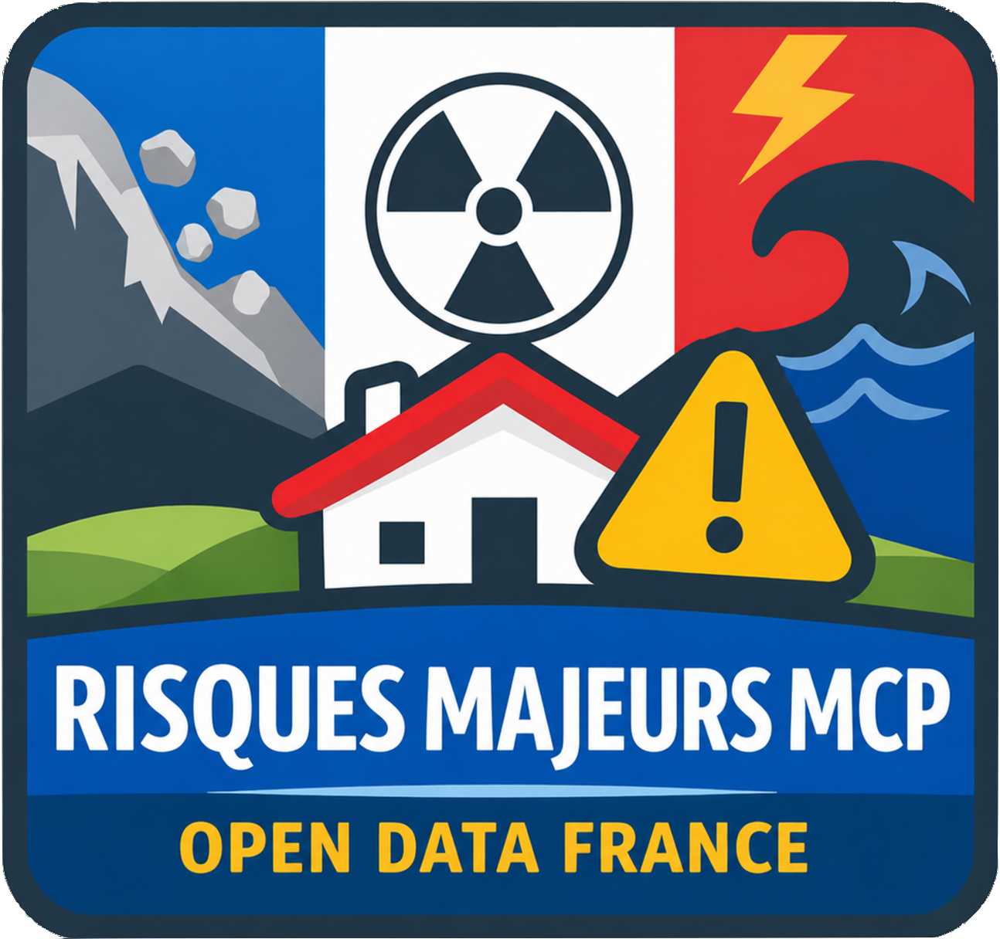

<p align="center">
  
</p>

# Risques Majeurs MCP

Serveur [MCP](https://modelcontextprotocol.io/) (Model Context Protocol) permettant d'interroger l'exposition aux risques majeurs en France. Il s'appuie sur les API publiques de [Géorisques](https://www.georisques.gouv.fr/) et de la [Géoplateforme IGN](https://data.geopf.fr/) pour fournir des données de géocodage et d'évaluation des risques, ainsi qu'une carte interactive de visualisation.

## Fonctionnalités

Le serveur expose 4 outils MCP :

| Outil | Description |
|---|---|
| **geocodage** | Géocode une adresse en France (adresse → coordonnées GPS + code INSEE) via l'API IGN Geoplateforme |
| **liste_risques** | Liste les risques disponibles et leur disponibilité (exposition textuelle / carte) |
| **exposition_risques** | Retourne le niveau d'exposition aux risques en texte pour des coordonnées données |
| **carte_exposition_risques** | Retourne l'exposition structurée et l'affiche sur une carte interactive (MCP App) |

### Risques couverts

| Code | Risque | Source API Géorisques (v1) | Source API Géorisques (v2) |
|---|---|---|---|
| `argiles` | Retrait-gonflement des argiles | `/api/v1/rga` | `/api/v2/rga` |
| `mouvement_terrain` | Mouvements de terrain | `/api/v1/mvt` | `/api/v2/mvt` |
| `cavites` | Cavités souterraines | `/api/v1/cavites` | `/api/v2/cavites` |
| `inondations` | Inondations (TRI, AZI, PAPI, PPRN) | `/api/v1/gaspar/tri`, `azi`, `papi`, `/api/v1/ppr` | `/api/v2/gaspar/tri`, `azi`, `papi`, `pprn` |
| `catnat` | Catastrophes naturelles (CatNat) | `/api/v1/gaspar/catnat` | — |
| `icpe` | Installations classées Seveso (ICPE) | `/api/v1/installations_classees` | `/api/v2/installations_classees` |
| `installations_nucleaires` | Installations nucléaires | `/api/v1/installations_nucleaires` | `/api/v2/installations_nucleaires` |

Les endpoints v2 sont utilisés lorsque la variable d'environnement `API_V2_TOKEN` est configurée (jeton d'authentification Géorisques). Sinon, les endpoints v1 publics sont utilisés.

### Carte interactive

L'outil `carte_exposition_risques` inclut une application web embarquée (MCP App) basée sur [MapLibre GL](https://maplibre.org/) qui affiche les couches de risques sur un fond de carte, avec contrôle des couches et légendes.

## Prérequis

- [Node.js](https://nodejs.org/) >= 24 (ou utilisez [mise](https://mise.jdx.dev/) pour installer la bonne version automatiquement)

## Utilisation

### Sans installation locale (via `npx`)

Le moyen le plus rapide de connecter le serveur a un client MCP est de le lancer en stdio directement depuis GitHub :

```bash
npx -y github:MAIF/risques-majeurs-mcp --stdio
```

Au premier appel, npx clone le repo, installe les dependances et execute le build (`tsc` + `vite`) via le script `prepare`. Les appels suivants reutilisent le cache de npx.

Configuration MCP correspondante :

```json
{
  "mcpServers": {
    "risques-majeurs": {
      "command": "npx",
      "args": ["-y", "github:MAIF/risques-majeurs-mcp", "--stdio"]
    }
  }
}
```

### Installation locale

```bash
git clone https://github.com/MAIF/risques-majeurs-mcp.git
cd risques-majeurs-mcp
npm install   # installe + build automatique via le script `prepare`
```

### Développement (HTTP avec hot-reload)

```bash
npm run start-dev
```

### Production (HTTP)

```bash
npm start
```

Le serveur démarre sur `http://localhost:3000/mcp` et peut être configuré via les variables d'environnement suivantes :

| Variable | Description | Défaut |
|---|---|---|
| `PORT` | Port d'écoute du serveur | `3000` |
| `NODE_ENV` | `development` pour écouter sur `127.0.0.1`, sinon `0.0.0.0` | — |
| `CORS_ORIGIN` | Origine autorisée pour les requêtes CORS | `*` |
| `RATE_LIMIT_WINDOW_MS` | Fenêtre de temps du rate limiting (en ms) | `60000` |
| `RATE_LIMIT_MAX` | Nombre max de requêtes par fenêtre par IP | `100` |
| `TRUST_PROXY` | Configure Express `trust proxy` (`true`, `false`, un nombre de sauts, `loopback`, une IP ou un CIDR). Nécessaire derrière un reverse-proxy (nginx, ngrok, Cloudflare…) pour que le rate-limit identifie correctement l'IP client | — |
| `API_V2_TOKEN` | Jeton d'authentification Géorisques (si configuré, les endpoints V2 sont utilisés) | `` |

### Configuration MCP

Pour connecter ce serveur à un client MCP, ajoutez-le dans votre configuration :

```json
{
  "mcpServers": {
    "risques-majeurs": {
      "url": "http://localhost:3000/mcp"
    }
  }
}
```

## Transport

Le serveur supporte deux transports MCP :

- **Streamable HTTP** (par défaut) — [spec](https://modelcontextprotocol.io/specification/2025-03-26/basic/transports#streamable-http). Mode **stateless** : chaque requête est indépendante et aucun identifiant de session n'est généré. Tous les outils exposés étant en lecture seule et idempotents, il n'y a pas besoin de maintenir un état entre les requêtes.
- **stdio** — pour les clients qui lancent le serveur comme sous-processus (Claude Desktop, Codex CLI, etc.). Activé via le flag `--stdio` (ou la variable d'environnement `MCP_TRANSPORT=stdio`) :

```bash
npm run start-stdio
# ou en mode dev avec hot-reload
npm run start-dev-stdio
# ou directement
node dist/index.js --stdio
```

En mode stdio, le serveur n'écoute pas sur HTTP ; toute la communication passe par stdin/stdout. Les logs sont redirigés vers stderr pour ne pas corrompre le flux JSON-RPC.

## Architecture

```
server/
  index.ts       # Point d'entrée Express, transport Streamable HTTP
  server.ts      # Définition du serveur MCP et des outils
  risques.ts     # Définition des risques (fetch, schémas, texte, couches carte)
  utils.ts       # Helpers (appels API Géorisques, sources WMS, icônes SVG)
client/
  mcp-app.html   # Page HTML de l'application carte
  mcp-app.ts     # Application MCP App (MapLibre GL)
  mcp-app.css    # Styles
  controls.ts    # Contrôles MapLibre (couches, légendes, plein écran)
```

## APIs externes utilisées

- **[Géorisques](https://www.georisques.gouv.fr/)** — Données et services WMS sur les risques naturels et technologiques (Ministère de la Transition Écologique)
- **[Géoplateforme IGN](https://data.geopf.fr/)** — Géocodage des adresses en France
- **[CARTO](https://carto.com/)** — Tuiles de fond de carte

## Licence

Ce projet est distribué sous licence [Apache 2.0](./LICENSE).
