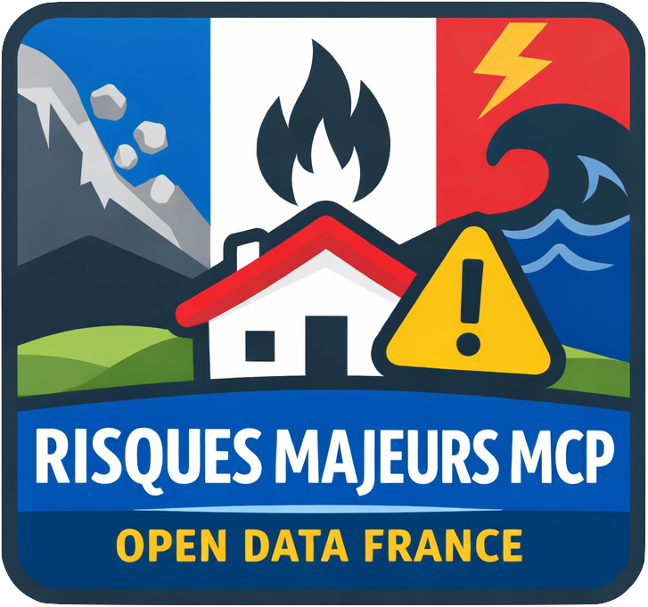

<p align="center">
  
</p>

# Risques Majeurs MCP

Serveur [MCP](https://modelcontextprotocol.io/) (Model Context Protocol) permettant d'interroger l'exposition aux risques majeurs en France. Il s'appuie sur les API publiques de [Géorisques](https://www.georisques.gouv.fr/) et de la [Géoplateforme IGN](https://data.geopf.fr/) pour fournir des données de géocodage et d'évaluation des risques, ainsi qu'une carte interactive de visualisation.

## Fonctionnalités

Le serveur expose 4 outils MCP :

| Outil | Description |
|---|---|
| **geocodage** | Géocode une adresse en France (adresse → coordonnées GPS + code INSEE) via l'API IGN Geoplateforme |
| **liste_risques** | Liste les risques disponibles et leur disponibilité (exposition textuelle / carte) |
| **exposition_risques** | Retourne le niveau d'exposition aux risques en texte pour des coordonnées données |
| **carte_exposition_risques** | Retourne l'exposition structurée et l'affiche sur une carte interactive (MCP App) |

### Risques couverts

| Code | Risque | Source API Géorisques |
|---|---|---|
| `argiles` | Retrait-gonflement des argiles | `/api/v1/rga` |
| `mouvement_terrain` | Mouvements de terrain | `/api/v1/mvt` |
| `cavites` | Cavités souterraines | `/api/v1/cavites` |
| `inondations` | Inondations (TRI, AZI, PAPI, PPRN) | `/api/v1/gaspar/tri`, `azi`, `papi`, `/api/v1/ppr` |
| `catnat` | Catastrophes naturelles (CatNat) | `/api/v1/gaspar/catnat` |
| `icpe` | Installations classées Seveso (ICPE) | `/api/v1/installations_classees` |
| `installations_nucleaires` | Installations nucléaires | `/api/v1/installations_nucleaires` |

### Carte interactive

L'outil `carte_exposition_risques` inclut une application web embarquée (MCP App) basée sur [MapLibre GL](https://maplibre.org/) qui affiche les couches de risques sur un fond de carte, avec contrôle des couches et légendes.

## Prérequis

- [Node.js](https://nodejs.org/) >= 20

## Installation

```bash
npm install
```

## Utilisation

### Développement

```bash
npm run start-dev
```

### Production

```bash
npm run build
npm start
```

Le serveur démarre sur `http://localhost:3000/mcp` (configurable via la variable d'environnement `PORT`).

### Configuration MCP

Pour connecter ce serveur à un client MCP, ajoutez-le dans votre configuration :

```json
{
  "mcpServers": {
    "risques-majeurs": {
      "url": "http://localhost:3000/mcp"
    }
  }
}
```

## Architecture

```
server/
  index.ts       # Point d'entrée Express, transport Streamable HTTP
  server.ts      # Définition du serveur MCP et des outils
  risques.ts     # Définition des risques (fetch, schémas, texte, couches carte)
  utils.ts       # Helpers (appels API Géorisques, sources WMS, icônes SVG)
client/
  mcp-app.html   # Page HTML de l'application carte
  mcp-app.ts     # Application MCP App (MapLibre GL)
  mcp-app.css    # Styles
  controls.ts    # Contrôles MapLibre (couches, légendes, plein écran)
```

## APIs externes utilisées

- **[Géorisques](https://www.georisques.gouv.fr/)** — Données et services WMS sur les risques naturels et technologiques (Ministère de la Transition Écologique)
- **[Géoplateforme IGN](https://data.geopf.fr/)** — Géocodage des adresses en France
- **[CARTO](https://carto.com/)** — Tuiles de fond de carte

## Licence

Ce projet est distribué sous licence [Apache 2.0](./license).
